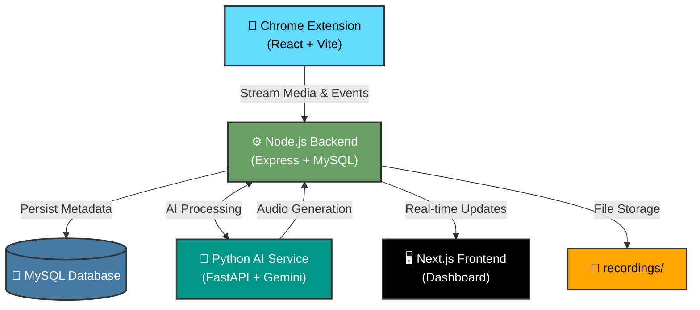

<div align="center">

# 🎬 Clueso Clone

**AI-Powered Screen Recording & Tutorial Generation Platform**

[](https://nextjs.org/)
[](https://react.dev/)
[](https://fastapi.tiangolo.com/)
[](https://nodejs.org/)

*A comprehensive full-stack application that replicates Clueso.io's core functionality - recording user interactions, generating AI-powered insights, and producing high-quality tutorial videos with AI voiceovers.*

[Features](#-features) • [Quick Start](#-quick-start) • [Architecture](#️-architecture) • [Documentation](#-documentation)

</div>

---

## ✨ Features

### 🎥 **Screen Recording**
- High-fidelity screen and audio capture via Chrome extension
- Real-time DOM interaction tracking
- Automatic video optimization and processing

### 🤖 **AI-Powered Narration**
- Google Gemini AI for intelligent script generation
- Deepgram TTS for professional voiceovers
- Context-aware narration synchronized with user actions

### 📊 **Real-Time Dashboard**
- Live recording playback with synchronized timelines
- Project management and organization
- Team collaboration features
- Video template library

### 🔄 **Seamless Integration**
- WebSocket-based real-time updates
- Consolidated storage system
- MySQL database for metadata persistence
- RESTful API endpoints

---

## 🏗️ Architecture

The system consists of four interconnected components designed for high performance and scalability:



---

## 🚀 Quick Start

### Prerequisites

- **Node.js** 18+ and npm
- **Python** 3.8+
- **MySQL** 8.0+
- **FFmpeg** (for video processing)
- **Google Chrome** browser
- **API Keys**: Gemini AI, Deepgram

### ⚡ Automated Setup (Recommended)

**Step 1: Verify System Requirements**
```powershell
.\check-setup.ps1
```
*Validates Node, Python, FFmpeg, MySQL, and API configurations*

**Step 2: Launch All Services**
```powershell
.\start-all-services.ps1
```
*Starts Node Backend (Port 3000), Frontend (Port 3001), and Python AI (Port 8000)*

**Step 3: Install Chrome Extension**
1. Open Chrome and navigate to `chrome://extensions/`
2. Enable "Developer mode" (top right)
3. Click "Load unpacked"
4. Select `Clueso_extension/dist` folder

### 🔧 Manual Setup

<details>
<summary>Click to expand manual setup instructions</summary>

#### 1. Clone Repository
```bash
git clone <repository-url>
cd clueso-clone
```

#### 2. Setup MySQL Database
```sql
CREATE DATABASE clueso_db;
```

#### 3. Configure Environment Variables

**Node Backend** (`Clueso_Node_layer/.env`):
```env
DB_HOST=localhost
DB_USER=root
DB_PASSWORD=your_password
DB_NAME=clueso_db
DB_PORT=3306
DEEPGRAM_API_KEY=your_deepgram_key
PORT=3000
```

**Python AI Service** (`ProductAI/.env`):
```env
GEMINI_API_KEY=your_gemini_key
DEEPGRAM_API_KEY=your_deepgram_key
```

**Frontend** (`Clueso_Frontend_layer/.env.local`):
```env
NEXT_PUBLIC_BACKEND_URL=http://localhost:3000
```

#### 4. Install Dependencies

**Node Backend:**
```bash
cd Clueso_Node_layer
npm install
```

**Python AI Service:**
```bash
cd ProductAI
python -m venv venv
.\venv\Scripts\activate  # Windows
source venv/bin/activate  # macOS/Linux
pip install -r requirements.txt
```

**Frontend:**
```bash
cd Clueso_Frontend_layer
npm install
```

**Chrome Extension:**
```bash
cd Clueso_extension
npm install
npm run build
```

#### 5. Start Services

**Terminal 1 - Node Backend:**
```bash
cd Clueso_Node_layer
npm run dev
```

**Terminal 2 - Python AI:**
```bash
cd ProductAI
.\venv\Scripts\activate
uvicorn app.main:app --reload --port 8000
```

**Terminal 3 - Frontend:**
```bash
cd Clueso_Frontend_layer
npm run dev
```

</details>

---

## 📦 Project Structure

```
clueso-clone/
├── 🔌 Clueso_extension/          # Chrome Extension (React + Vite)
│   ├── public/                   # Extension manifest & assets
│   ├── src/                      # React components & logic
│   └── dist/                     # Built extension (load this in Chrome)
│
├── ⚙️ Clueso_Node_layer/          # Node.js Backend (Express)
│   ├── src/
│   │   ├── controllers/          # Request handlers
│   │   ├── models/               # Sequelize models
│   │   ├── routes/               # API routes
│   │   └── services/             # Business logic
│   └── uploads/                  # Temporary file storage
│
├── 🤖 ProductAI/                  # Python AI Service (FastAPI)
│   ├── app/
│   │   ├── main.py              # FastAPI application
│   │   ├── services/            # AI & TTS services
│   │   └── models/              # Pydantic models
│   └── venv/                    # Python virtual environment
│
├── 🖥️ Clueso_Frontend_layer/     # Next.js Dashboard
│   ├── app/                     # Next.js 16 app directory
│   │   ├── (auth)/             # Authentication pages
│   │   ├── dashboard/          # Dashboard pages
│   │   ├── projects/           # Project management
│   │   ├── templates/          # Video templates
│   │   └── team/               # Team management
│   ├── components/             # React components
│   └── hooks/                  # Custom React hooks
│
├── 📁 recordings/                # Consolidated storage for all recordings
│
└── 🛠️ Scripts/                   # Automation scripts
    ├── check-setup.ps1          # System verification
    ├── start-all-services.ps1   # Service launcher
    └── diagnose-recording.ps1   # Debugging tool
```

---

## 🔌 API Endpoints

### Node.js Backend (Port 3000)

#### Recordings
| Method | Endpoint | Description |
|--------|----------|-------------|
| `GET` | `/api/recordings` | List all recordings |
| `GET` | `/api/recordings/:id` | Get recording details |
| `POST` | `/api/recordings/start` | Start new recording |
| `POST` | `/api/recordings/stop` | Stop active recording |
| `DELETE` | `/api/recordings/:id` | Delete recording |

#### Media Upload
| Method | Endpoint | Description |
|--------|----------|-------------|
| `POST` | `/api/upload/video-chunk` | Upload video chunk |
| `POST` | `/api/upload/audio-chunk` | Upload audio chunk |
| `POST` | `/api/upload/events` | Upload DOM events |

#### Processing
| Method | Endpoint | Description |
|--------|----------|-------------|
| `POST` | `/api/process/finalize` | Finalize recording |
| `GET` | `/api/process/status/:id` | Check processing status |

### Python AI Service (Port 8000)

| Method | Endpoint | Description |
|--------|----------|-------------|
| `POST` | `/analyze` | Analyze events & generate script |
| `POST` | `/generate-audio` | Generate AI voiceover |
| `GET` | `/health` | Service health check |

---

## 🧪 Usage Guide

### Recording a Tutorial

1. **Start Recording**
   - Click the Clueso extension icon in Chrome
   - Click "Start Recording"
   - Grant screen and microphone permissions

2. **Perform Actions**
   - Navigate and interact with any website
   - Speak naturally to narrate your actions
   - All clicks, scrolls, and inputs are tracked

3. **Stop Recording**
   - Click the extension icon again
   - Click "Stop Recording"
   - Wait for "Processing Complete" notification

4. **View & Share**
   - Open dashboard at `http://localhost:3001`
   - Find your recording in "Recent Recordings"
   - Play, edit, or share your tutorial

### Dashboard Features

- **📊 All Projects**: View and manage all recordings
- **🎬 New Video**: Create new recording projects
- **📝 Templates**: Browse pre-made video templates
- **👥 Team**: Manage team members and permissions
- **⚙️ Settings**: Configure preferences and integrations

---

## 🛠️ Troubleshooting

### Common Issues

<details>
<summary><b>❌ Empty Player / No Video Showing</b></summary>

**Cause**: Node backend not running or database connection failed

**Solution**:
1. Verify Node backend is running: `http://localhost:3000/health`
2. Check MySQL connection in Node terminal
3. Ensure `recordings/` folder exists in project root
4. Restart Node backend: `npm run dev`
</details>

<details>
<summary><b>❌ AI Processing Error</b></summary>

**Cause**: Missing API keys or Python service down

**Solution**:
1. Verify Python service: `http://localhost:8000/health`
2. Check `.env` files for `GEMINI_API_KEY` and `DEEPGRAM_API_KEY`
3. Restart Python service with activated venv
4. Check Python terminal for error logs
</details>

<details>
<summary><b>❌ Extension Not Recording</b></summary>

**Cause**: Extension not built or permissions denied

**Solution**:
1. Rebuild extension: `cd Clueso_extension && npm run build`
2. Reload extension in `chrome://extensions/`
3. Grant screen and microphone permissions when prompted
4. Check browser console for errors (F12)
</details>

<details>
<summary><b>❌ Port Already in Use</b></summary>

**Cause**: Services already running or port conflict

**Solution**:
```powershell
# Windows - Kill process on port
netstat -ano | findstr :3000
taskkill /PID <PID> /F

# Or change port in .env files
```
</details>

<details>
<summary><b>❌ FFmpeg Not Found</b></summary>

**Cause**: FFmpeg not installed or not in PATH

**Solution**:
1. Download FFmpeg: https://ffmpeg.org/download.html
2. Add to system PATH
3. Verify: `ffmpeg -version`
4. Restart terminals after PATH update
</details>

### Debug Tools

**Run Diagnostics:**
```powershell
.\diagnose-recording.ps1
```

**Test All Endpoints:**
```powershell
node test-all-endpoints.js
```

**Check Logs:**
- Node Backend: Check terminal output
- Python AI: Check terminal output
- Frontend: Check browser console (F12)
- Extension: Check `chrome://extensions/` → Details → Inspect views

---

## 🔄 Key Improvements Over Original

This enhanced version includes significant improvements:

### 🎯 **Consolidated Storage**
- Single `recordings/` folder for all media
- Eliminates split directory confusion
- Universal access across all services

### 🚀 **Infrastructure Automation**
- PowerShell scripts for setup verification
- One-command service launcher
- Automated dependency checking

### ⚡ **Performance Enhancements**
- Bootstrap session loading for instant playback
- Optimized video processing pipeline
- Real-time WebSocket updates

### 🤖 **AI Optimization**
- Professional script generation without preambles
- Deepgram TTS integration
- Context-aware narration timing

### 📱 **Enhanced Dashboard**
- Modern UI with TailwindCSS
- Project management features
- Team collaboration tools
- Video template library

---

## 🛡️ Technology Stack

### Frontend
- **Framework**: Next.js 16 (App Router)
- **UI Library**: React 19
- **Styling**: TailwindCSS 4
- **State Management**: Zustand
- **Real-time**: Socket.IO Client
- **Language**: TypeScript

### Backend
- **Runtime**: Node.js
- **Framework**: Express 5
- **Database**: MySQL 8 + Sequelize ORM
- **Real-time**: Socket.IO
- **File Processing**: FFmpeg, Multer
- **API Integration**: Deepgram SDK

### AI Service
- **Framework**: FastAPI
- **AI Model**: Google Gemini AI
- **TTS**: Deepgram / ElevenLabs
- **Audio Processing**: Pydub
- **Language**: Python 3.8+

### Extension
- **Framework**: React 19
- **Build Tool**: Vite
- **Manifest**: Chrome MV3
- **Recording**: MediaRecorder API

---

## 📚 Documentation

- [Node.js Integration Guide](ProductAI/python_integration_guide.md.resolved)
- [RAG Synced Narration Guide](ProductAI/RAG_SYNCED_NARRATION_GUIDE.md)
- [Node.js Compatibility Analysis](ProductAI/NODEJS_COMPATIBILITY_ANALYSIS.md)

---

## 🤝 Contributing

Contributions are welcome! Please follow these guidelines:

1. Fork the repository
2. Create a feature branch (`git checkout -b feature/AmazingFeature`)
3. Commit your changes (`git commit -m 'Add some AmazingFeature'`)
4. Push to the branch (`git push origin feature/AmazingFeature`)
5. Open a Pull Request

---

## 📄 License

This project is licensed under the ISC License.

---

## 💜 Acknowledgments

Special thanks to **[Tushar7436](https://github.com/Tushar7436)** for providing the core logic and baseline architecture. This enhanced version focuses on stability, comprehensive documentation, and a seamless developer experience.

---

## 📞 Support

For issues, questions, or contributions:
- 🐛 [Report a Bug](../../issues)
- 💡 [Request a Feature](../../issues)
- 📖 [View Documentation](#-documentation)

---

<div align="center">

**Built with ❤️ using Next.js, React, FastAPI, and AI**

⭐ Star this repo if you find it helpful!

</div>
